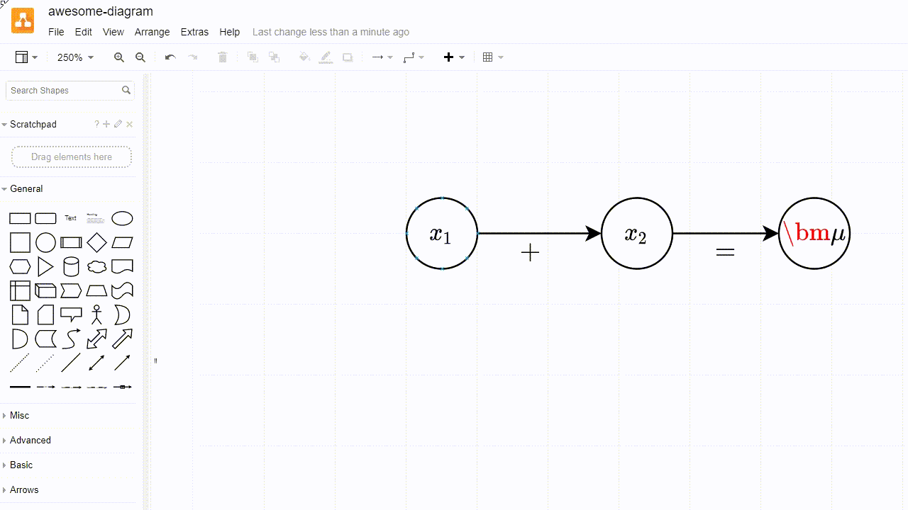

# DrawIO2PDF

## Intro
Always wondered how to make beautiful mathematical figures with latex inside
them? You can use [tikz](https://texample.net/tikz/examples/) but it's learning
curve is steep and many only ascended people can use it fluently. How about
[draw.io](https://app.diagrams.net/)? It allows you to make beautiful figures.
What's better, you can latex-type there. But what is that? Have you tried to
export it into PDF? No? I don't recommend that if you have a figure full of
maths and you still want to have your eyes unharmed.

This is why I created this tool. You can export your figures from draw.io
without worrying that it will break any math font. The output is essentially
unrecognizable from a standard tikz figure. It will look beautiful in your PDF
document and since it's a vector graphic, everyone can zoom in to take a deeper
look into your diagram.

## Requirements

- [inkscape](https://inkscape.org/) >= 1.0
- pdflatex (I use `sudo apt-get install texlive-full` for that)
- python  >= 3.6


## Installation

From the pip repository:
```
pip install drawio2pdf
```

or from git:
```
pip install git+https://github.com/kacperkan/drawio2pdf/
```


## Usage
1. Create your beautiful diagram, using latex formulas and so on.
2. Disable `Extras > Mathematical Typesetting`.
3. Export your diagram with SVG.
4. `drawio2pdf <path-where-you-saved-your-svg>.`



The script will a PDF in the same folder and the same file name.

The result:


## FAQ
**Q: I get `AssertionError: Incorrect PDF latex generation` while running you script!**

A: I met these issue personally in one of the following cases:
- I didn't have `pdflatex` or `inkscape` that was runnable from the console
- I accidentally put a new line in the math formula. When using `Mathematical
  Typesetting`, draw.io will render it correctly. However, the SVG file content
  will be completely broken and it's not that obvious how to parse it with the
  `ETree` in python. **Solution:** Remove any newline in mathematical formulas
  so they're one liners
- I totally forgot to turn `Mathematical Typesetting` off.
<br/>
<br/>

## Licence
This project is licensed under the terms of the MIT license.


